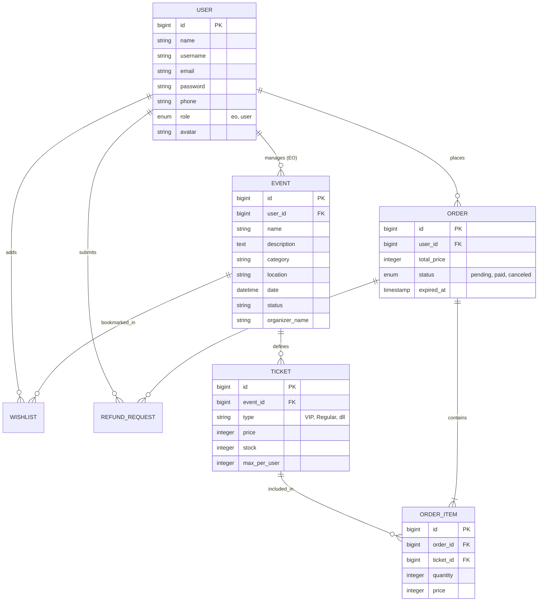
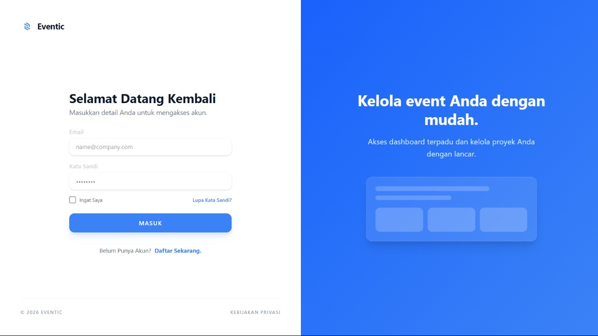
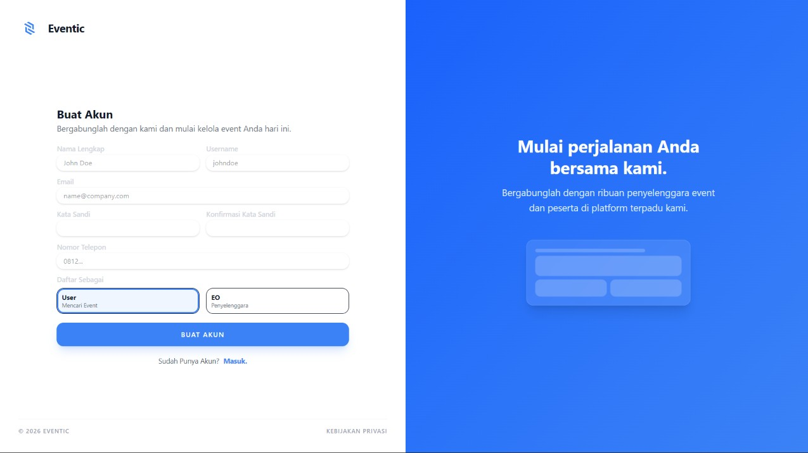
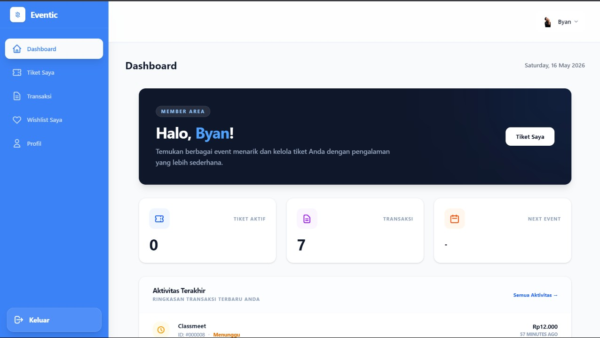
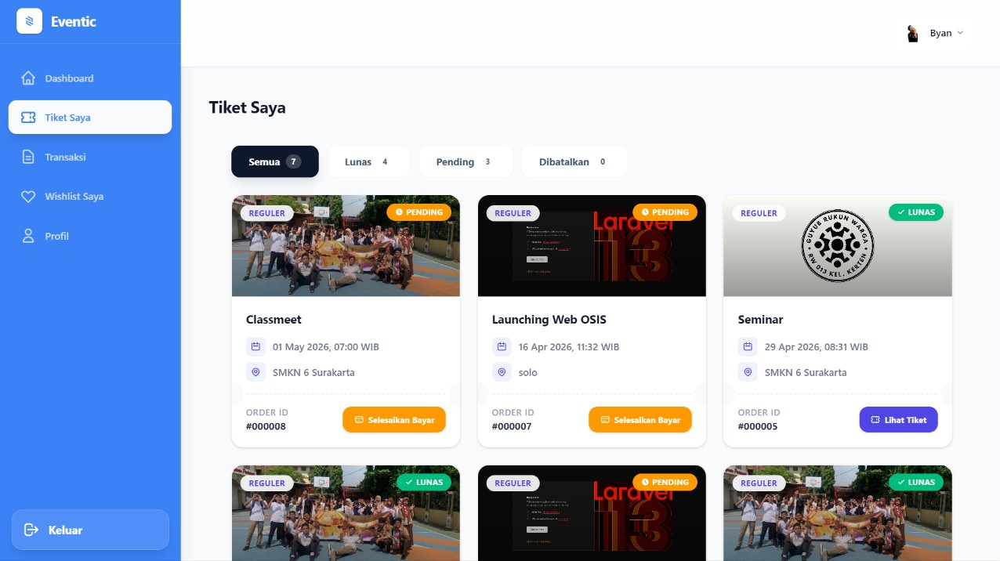
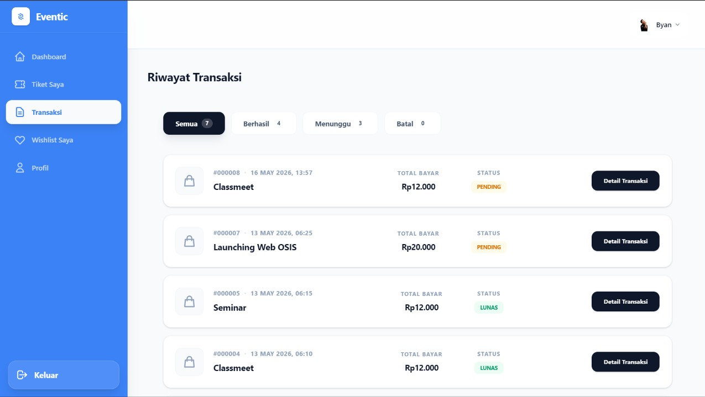
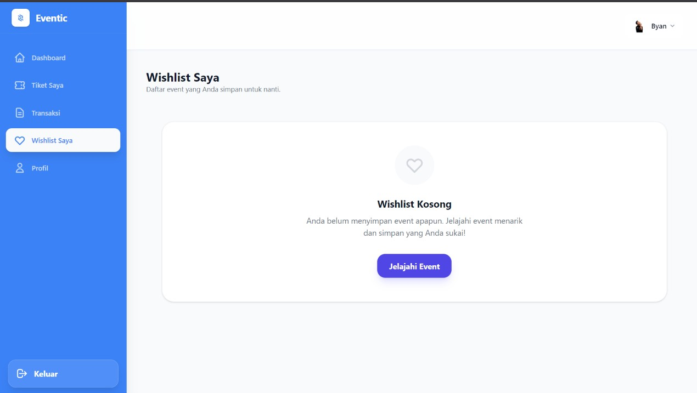
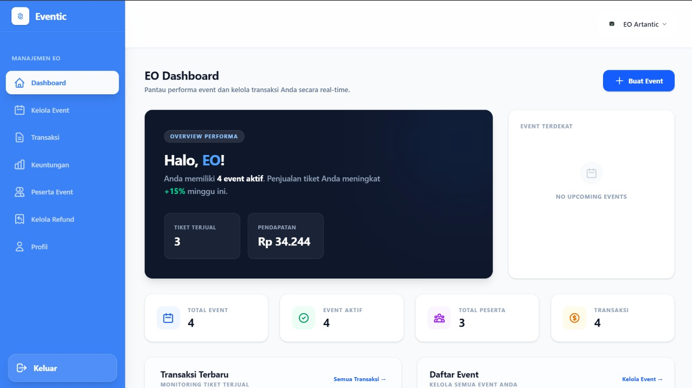
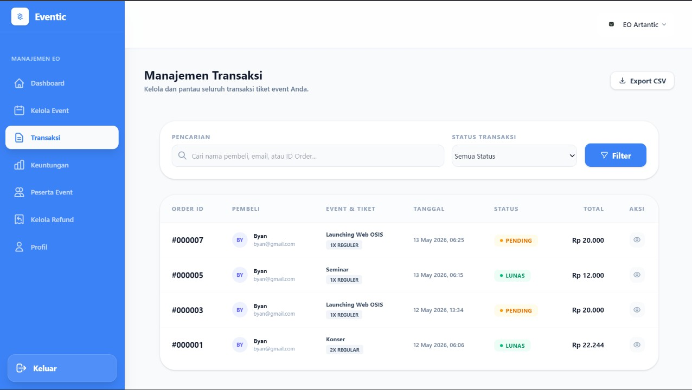
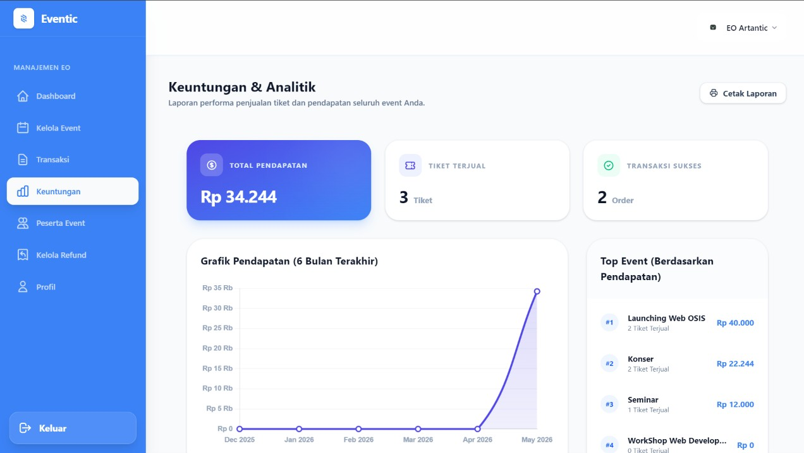

<div align="center">


# 🎟️ Eventic

**Platform Manajemen & Pembelian Tiket Event Modern**

[](https://laravel.com)
[](https://php.net)
[](https://tailwindcss.com)
[](https://alpinejs.dev)
[](https://filamentphp.com)
[](https://laravel.com/docs/starter-kits#laravel-breeze)
[](https://vitejs.dev)

*Solusi terpadu untuk mengelola, mempromosikan, dan membeli tiket event — semua dalam satu platform yang elegan.*


</div>

---

## 📋 Deskripsi

**Eventic** adalah platform web manajemen tiket event berbasis Laravel 13 yang dirancang untuk menghubungkan **Event Organizer (EO)** dengan **pengguna/pembeli tiket**. Platform ini menghadirkan pengalaman end-to-end mulai dari pembuatan event, penjualan tiket, hingga proses pembayaran — semuanya dalam antarmuka yang modern, responsif, dan mudah digunakan.

Dibangun dengan arsitektur **multi-role** (Event Organizer, User), Eventic memastikan setiap pihak memiliki akses dan kontrol yang tepat sesuai perannya. EO mengelola event dan memantau performa secara real-time, sementara pengguna dapat mencari, membeli, dan mengelola tiket mereka dengan mudah.

---

## ✨ Fitur Unggulan

### 🎭 Untuk Pengguna (User)
| Fitur | Deskripsi |
|-------|-----------|
| 🔍 **Pencarian & Filter Event** | Temukan event berdasarkan kategori, lokasi, dan tanggal |
| 🛒 **Checkout Multi-Tiket** | Beli berbagai jenis tiket (Reguler, VIP, VVIP) dalam satu transaksi |
| 💳 **Multi Metode Pembayaran** | Dukungan GoPay, OVO, DANA, BCA VA, dan BRI VA |
| ❤️ **Wishlist Event** | Simpan event favorit dan pantau perkembangannya |
| 🎫 **Tiket Digital dengan QR Code** | Tiket digital otomatis digenerate dengan QR Code unik setelah pembayaran |
| 📜 **Riwayat Transaksi** | Pantau semua transaksi dengan filter status (Lunas / Pending / Batal) |
| 🔄 **Pengajuan Refund** | Ajukan refund dengan alasan yang terstruktur |
| 👤 **Manajemen Profil** | Update informasi akun dan ubah password dengan aman |

### 🏢 Untuk Event Organizer (EO)
| Fitur | Deskripsi |
|-------|-----------|
| 📊 **Dashboard Analytics** | Pantau total pendapatan, tiket terjual, dan event aktif secara real-time |
| 📅 **Manajemen Event Lengkap** | Buat, edit, dan publish event dengan form yang komprehensif |
| 🎟️ **Pengaturan Multi-Tiket** | Atur berbagai tipe tiket dengan harga dan stok terpisah (hingga 5 tiket/user) |
| 📋 **Daftar Peserta** | Lihat detail semua peserta yang telah membeli tiket |
| 💰 **Laporan Transaksi EO** | Monitor semua transaksi event dengan breakdown per tiket |
| 🔄 **Kelola Permintaan Refund** | Approve atau tolak permintaan refund dari pembeli |
| 📷 **Upload Banner Event** | Upload gambar banner event dengan preview langsung |
| 💼 **Profil Penyelenggara** | Kelola informasi EO termasuk sosial media (Instagram, TikTok) |

---

## 🛠️ Tech Stack

### Backend
| Teknologi | Versi | Peran |
|-----------|-------|-------|
| **PHP** | ^8.3 | Runtime bahasa utama |
| **Laravel** | ^13.0 | Framework aplikasi web |
| **Filament** | ^5.6 | Panel Dashboard UI |
| **Laravel Breeze** | ^2.4 | Autentikasi & scaffolding |
| **barryvdh/laravel-dompdf** | ^3.1 | Generate PDF tiket |
| **simplesoftwareio/simple-qrcode** | ^4.2 | Generate QR Code tiket digital |

### Frontend
| Teknologi | Versi | Peran |
|-----------|-------|-------|
| **Tailwind CSS** | ^4.2 | Utility-first CSS framework |
| **Alpine.js** | ^3.4 | Reactive UI & interaktivitas |
| **Vite** | ^8.0 | Build tool & HMR |
| **Axios** | ^1.11 | HTTP client |

### Database & Infrastruktur
| Teknologi | Peran |
|-----------|-------|
| **MySQL** | Database relasional |
| **Laravel Eloquent ORM** | Query builder & relasi model |
| **Laravel Queue** | Proses background jobs |

---

## 🚀 Cara Menjalankan Proyek

### Prasyarat
Pastikan sistem Anda telah memiliki:
- **PHP** >= 8.3
- **Composer** >= 2.x
- **Node.js** >= 18.x & **NPM**
- **MySQL**
- **Git**

### 1. Clone Repositori

```bash
git clone https://github.com/Byatarade/Eventic-PJBL.git
cd Eventic-PJBL
```

### 2. Install Dependensi PHP

```bash
composer install
```

### 3. Konfigurasi Environment

```bash
# Salin file environment
cp .env.example .env

# Generate application key
php artisan key:generate
```

Kemudian buka file `.env` dan sesuaikan konfigurasi database:

```env
DB_CONNECTION=mysql
DB_HOST=127.0.0.1
DB_PORT=3306
DB_DATABASE=eventic_db
DB_USERNAME=root
DB_PASSWORD=
```

> **Tip:** Untuk development cepat, gunakan SQLite dengan mengubah `DB_CONNECTION=sqlite` dan hapus baris DB_HOST, DB_PORT, DB_DATABASE, DB_USERNAME, DB_PASSWORD. File database akan dibuat otomatis.

### 4. Migrasi & Seeding Database

```bash
# Jalankan migrasi
php artisan migrate

# (Opsional) Jalankan seeder untuk data dummy
php artisan db:seed
```

### 5. Install Dependensi Frontend

```bash
npm install
```

### 6. Konfigurasi Storage

```bash
# Buat symlink storage untuk akses file publik
php artisan storage:link
```

### 7. Jalankan Aplikasi

**Opsi A — Jalankan semua sekaligus (Direkomendasikan):**
```bash
composer run dev
```
> Perintah ini akan menjalankan Laravel server, Queue listener, dan Vite dev server secara bersamaan.

**Opsi B — Jalankan terpisah:**
```bash
# Terminal 1: Laravel server
php artisan serve

# Terminal 2: Vite asset bundler
npm run dev

# Terminal 3: Queue listener (opsional)
php artisan queue:listen
```

### 8. Akses Aplikasi

| URL | Keterangan |
|-----|-----------|
| `http://localhost:8000` | Halaman utama (Landing Page) |
| `http://localhost:8000/login` | Halaman login |
| `http://localhost:8000/register` | Halaman registrasi |
| `http://localhost:8000/dashboard` | Dashboard User |
| `http://localhost:8000/eo/dashboard` | Dashboard Event Organizer |

---

## 📁 Struktur Folder

```
Laravel-13/
├── 📁 app/
│   ├── 📁 Http/
│   │   ├── 📁 Controllers/
│   │   │   ├── 📁 Auth/              # Autentikasi (Login, Register, dll.)
│   │   │   ├── 📁 EO/                # Controller untuk Event Organizer
│   │   │   │   ├── DashboardController.php
│   │   │   │   ├── EventController.php
│   │   │   │   └── RefundController.php
│   │   │   ├── 📁 User/              # Controller untuk User
│   │   │   │   ├── CheckoutController.php
│   │   │   │   ├── DashboardController.php
│   │   │   │   ├── TicketController.php
│   │   │   │   ├── TransactionController.php
│   │   │   │   └── WishlistController.php
│   │   │   ├── ProfileController.php
│   │   │   └── PublicEventController.php
│   │   └── 📁 Middleware/
│   ├── 📁 Models/
│   │   ├── Event.php                 # Model Event
│   │   ├── Order.php                 # Model Transaksi/Pesanan
│   │   ├── OrderItem.php             # Model Item dalam Pesanan
│   │   ├── RefundRequest.php         # Model Permintaan Refund
│   │   ├── Ticket.php                # Model Tiket
│   │   ├── User.php                  # Model Pengguna
│   │   └── Wishlist.php              # Model Wishlist
│   └── 📁 Providers/
│
├── 📁 database/
│   ├── 📁 migrations/                # Skema database
│   ├── 📁 seeders/                   # Data awal
│   └── 📁 factories/
│
├── 📁 resources/
│   ├── 📁 css/                       # Stylesheet utama
│   ├── 📁 js/                        # JavaScript (Alpine.js, Axios)
│   └── 📁 views/
│       ├── 📁 auth/                  # View login, register
│       ├── 📁 components/            # Komponen Blade reusable
│       ├── 📁 layouts/               # Layout utama (app, sidebar, navbar)
│       ├── 📁 eo/                    # View Dashboard EO
│       │   ├── dashboard.blade.php
│       │   └── 📁 events/            # CRUD Event
│       ├── 📁 user/                  # View Dashboard User
│       │   ├── 📁 checkout/          # Alur pembelian tiket
│       │   ├── 📁 tickets/           # Manajemen tiket user
│       │   └── 📁 transactions/      # Riwayat transaksi
│       ├── 📁 events/                # Detail event publik
│       ├── 📁 profile/               # Pengaturan profil
│       ├── dashboard.blade.php       # Dashboard User utama
│       └── welcome.blade.php         # Landing Page
│
├── 📁 routes/
│   ├── web.php                       # Route web utama
│   └── auth.php                      # Route autentikasi
│
├── 📁 public/                        # Aset publik & entry point
├── 📁 storage/                       # File upload & log

├── 📁 Documentation/                 # Screenshot dokumentasi
├── .env.example                      # Template konfigurasi
├── composer.json                     # Dependensi PHP
├── package.json                      # Dependensi Node.js
├── tailwind.config.js                # Konfigurasi Tailwind CSS
└── vite.config.js                    # Konfigurasi Vite
```

---

## 🗄️ Arsitektur Database

Eventic menggunakan skema database relasional yang dioptimalkan untuk performa dan integritas data. Berikut adalah representasi visual dan detail teknis dari struktur database.

### Entity Relationship Diagram (ERD)



### Detail Tabel Utama

| Tabel | Deskripsi |
|-------|-----------|
| `users` | Menyimpan data autentikasi dan profil. Field `role` membedakan antara EO dan pembeli umum. |
| `events` | Entitas utama yang dikelola oleh EO. Menyimpan detail lokasi, waktu, dan metadata sosial media penyelenggara. |
| `tickets` | Definisi tipe tiket untuk setiap event. Menggunakan `unique` constraint pada kombinasi `event_id` dan `type`. |
| `orders` | Header transaksi yang mencatat status pembayaran dan batas waktu kedaluwarsa (expired). |
| `order_items` | Detail item dalam transaksi, mencatat harga saat transaksi (snapshot) untuk akurasi laporan keuangan. |
| `wishlists` | Tabel pivot yang menghubungkan pengguna dengan event yang diminati. |
| `refund_requests` | Mencatat permohonan pengembalian dana dengan alasan terstruktur dan pelacakan status oleh admin/EO. |

---

## 🔐 Keamanan & Optimasi
- **Hashing**: Semua password dienkripsi menggunakan algoritma `Bcrypt` (via Laravel native).
- **Soft Deletes**: (Opsional/Planned) Untuk menjaga jejak audit data transaksi.
- **Constraints**: Penggunaan `onDelete('cascade')` pada relasi kunci untuk menjaga integritas referensial.
- **Indexing**: Database diindeks pada kolom-kolom yang sering dicari seperti `status`, `event_id`, dan `user_id` untuk query yang lebih cepat.

---

## 📸 Dokumentasi

### 🌐 Landing Page

<table>
  <tr>
    <td align="center" width="25%">
      
      <br/><sub><b>Hero Section</b></sub>
    </td>
    <td align="center" width="25%">
      
      <br/><sub><b>Event Section</b></sub>
    </td>
    <td align="center" width="25%">
      
      <br/><sub><b>About Section</b></sub>
    </td>
    <td align="center" width="25%">
      
      <br/><sub><b>Contact Section</b></sub>
    </td>
  </tr>
  <tr>
    <td align="center" width="25%">
      
      <br/><sub><b>Footer</b></sub>
    </td>
    <td align="center" width="25%" colspan="3"></td>
  </tr>
</table>

### 🔐 Autentikasi

<table>
  <tr>
    <td align="center" width="25%">
      
      <br/><sub><b>Login</b></sub>
    </td>
    <td align="center" width="25%">
      
      <br/><sub><b>Register</b></sub>
    </td>
    <td align="center" width="25%"></td>
    <td align="center" width="25%"></td>
  </tr>
</table>

### 🛒 Alur Pembelian Tiket

<table>
  <tr>
    <td align="center" width="20%">
      
      <br/><sub><b>Pilih Kategori Tiket</b></sub>
    </td>
    <td align="center" width="20%">
      
      <br/><sub><b>Detail Event</b></sub>
    </td>
    <td align="center" width="20%">
      
      <br/><sub><b>Detail Pesanan</b></sub>
    </td>
    <td align="center" width="20%">
      
      <br/><sub><b>Metode Pembayaran</b></sub>
    </td>
    <td align="center" width="20%">
      
      <br/><sub><b>Pembayaran Berhasil</b></sub>
    </td>
  </tr>
</table>

### 👤 Dashboard Pengguna (User)

<table>
  <tr>
    <td align="center" width="25%">
      
      <br/><sub><b>Beranda User</b></sub>
    </td>
    <td align="center" width="25%">
      
      <br/><sub><b>Tiket Saya</b></sub>
    </td>
    <td align="center" width="25%">
      
      <br/><sub><b>Riwayat Transaksi</b></sub>
    </td>
    <td align="center" width="25%">
      
      <br/><sub><b>Wishlist Event</b></sub>
    </td>
  </tr>
  <tr>
    <td align="center" width="25%">
      
      <br/><sub><b>Pengaturan Profil</b></sub>
    </td>
    <td align="center" width="25%" colspan="3"></td>
  </tr>
</table>

### 🏢 Dashboard Event Organizer (EO)

<table>
  <tr>
    <td align="center" width="25%">
      
      <br/><sub><b>Beranda EO</b></sub>
    </td>
    <td align="center" width="25%">
      
      <br/><sub><b>Manajemen Event</b></sub>
    </td>
    <td align="center" width="25%">
      
      <br/><sub><b>Peserta Event</b></sub>
    </td>
    <td align="center" width="25%">
      
      <br/><sub><b>Transaksi EO</b></sub>
    </td>
  </tr>
  <tr>
    <td align="center" width="25%">
      
      <br/><sub><b>Laporan Keuntungan</b></sub>
    </td>
    <td align="center" width="25%">
      
      <br/><sub><b>Kelola Refund</b></sub>
    </td>
    <td align="center" width="25%">
      
      <br/><sub><b>Pengaturan Profil EO</b></sub>
    </td>
    <td align="center" width="25%"></td>
  </tr>
</table>


## 🤝 Kontribusi

Kontribusi sangat disambut! Silakan ikuti langkah berikut:

1. **Fork** repositori ini
2. Buat **branch** fitur baru: `git checkout -b feature/NamaFitur`
3. **Commit** perubahan: `git commit -m 'feat: tambah fitur keren'`
4. **Push** ke branch: `git push origin feature/NamaFitur`
5. Buat **Pull Request**

> Harap ikuti konvensi commit [Conventional Commits](https://www.conventionalcommits.org/en/v1.0.0/).

---

<div align="center">

Dibuat dengan &nbsp;

&nbsp; dan &nbsp;


Created by Byatarade. ig: @byatarade

</div>